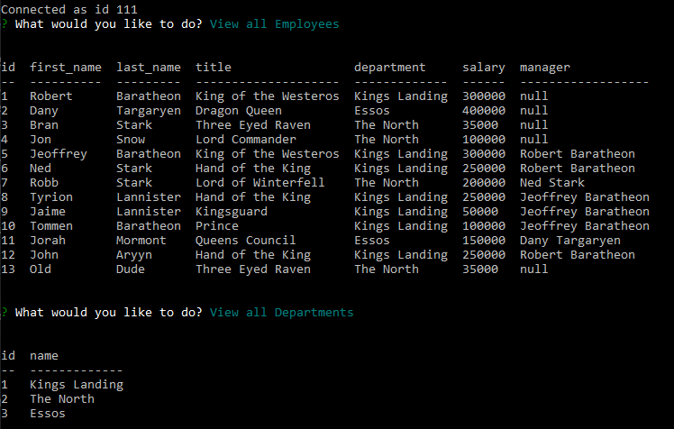

# Employee Tracker
## Table of Contents
  - [Project Description](#project-description)
  - [Installation](#installation)
  - [Usage](#usage)
  - [Contributing](#contributing)
  - [Testing](#testing)
  - [Questions](#questions)

## Walkthrough Video
[walkthrough video of app](https://drive.google.com/file/d/1aBKCsH8lkMxKD7WnWDBBWhkW87jb4xni/view)

## Project Description
This is a terminal side app that will manage your employees. You can manage departments, roles, and of course, employees. This app was part of a bootcamp weekly assignment and has all the fundamentals of MySQL and relational databases in it.

## Screenshot


## Installation
1. This is a Node.js application: please make sure you have [node downloaded](https://nodejs.org/en/download/)
2. Create a local repository and [clone](https://docs.github.com/en/free-pro-team@latest/github/creating-cloning-and-archiving-repositories/cloning-a-repository) this GitHub repository to it.
3. From your MySQL CLI; make sure you are in the root directory; run the following commands
```
source db/schema.sql
```
4. And if you would like seed data (Game of Thrones themed) run this command
```
source db/seeds.sql
```
5. Run the following code from the terminal to initiate the app
```
npm start
```
## Usage
1. When the app is started you will be presented with the main menu
2. You can browse through the several options and select what you would like to see and do
3. Please note that there are schema.sql and seed.sql files that can be loadedfor the app to work correctly
## Contributing
Please feel free to fork this repo and contribute as you see fit
## Testing
There are no testing capabilities
## Questions
* Please visit my [GitHub Profile](https://github.com/dalyd14)